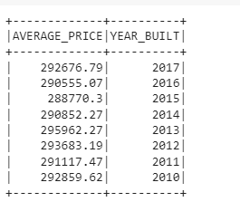
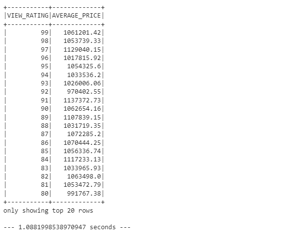
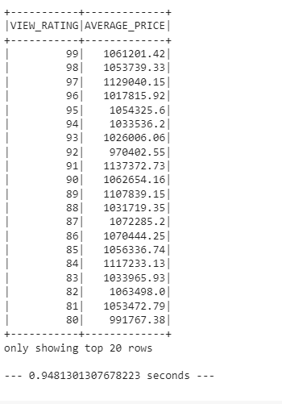

# Module 22 Challenge: Big Data Home Sales Analysis using SparkSQL

In this Challenge, we'll use our knowledge of SparkSQL to determine key metrics about home sales data. Then we'll use Spark to create temporary views, partition the data, cache and uncache a temporary table, and verify that the table has been uncached.

## Instructions
- Import the necessary PySpark SQL functions for this assignment.
- Read the home_sales_revised.csv data in the starter code into a Spark DataFrame.
- Create a temporary table called home_sales.
- Answer the following questions using SparkSQL:
    - What is the average price for a four-bedroom house sold for each year? Round off your answer to two decimal places.
    - What is the average price of a home for each year it was built that has three bedrooms and three bathrooms? Round off your answer to two decimal places.
    - What is the average price of a home for each year that has three bedrooms, three bathrooms, two floors, and is greater than or equal to 2,000 square feet? Round off your answer to two decimal places.
    - What is the "view" rating for homes costing more than or equal to $350,000? Determine the run time for this query, and round off your answer to two decimal places.
- Cache your temporary table home_sales.
- Check if your temporary table is cached.
- Using the cached data, run the query that filters out the view ratings with an average price of greater than or equal to $350,000. Determine the runtime and compare it to uncached runtime.
- Partition by the "date_built" field on the formatted parquet home sales data.
- Create a temporary table for the parquet data.
- Run the query that filters out the view ratings with an average price of greater than or equal to $350,000. Determine the runtime and compare it to uncached runtime.
- Uncache the home_sales temporary table.
- Verify that the home_sales temporary table is uncached using PySpark.

## Findings
**What is the average price for a four-bedroom house sold for each year? Round off your answer to two decimal places.**

We can observe that the average price for four-bedroom houses sold fluctuates slightly from year to year. In 2019, the average price was $300,263.70, which decreased slightly to $298,353.78 in 2020. However, the trend reversed in 2021, with the average price rising to $301,819.44. Finally, in 2022, the average price decreased again to $296,363.88.

**What is the average price of a home for each year it was built that has three bedrooms and three bathrooms? Round off your answer to two decimal places.**

We can observe that the average price of homes with 3 bedrooms and 3 bathrooms does not show a consistent increasing or decreasing trend based solely on the year the home was built. The average prices fluctuate without a clear pattern or linear progression from year to year.

**What is the average price of a home for each year built that have 3 bedrooms, 3 bathrooms, with two floors, and are greater than or equal to 2,000 square feet rounded to two decimal places?**

We can observe that the average price of homes with 3 bedrooms and 3 bathrooms with two floors and are greater than or equal to 2000 sq. ft. does not show a consistent increasing or decreasing trend based solely on the year the home was built. The average prices fluctuate without a clear pattern or linear progression from year to year.

**Using the original, cached data and parquet formatted data, run the query that filters out the view ratings with average price of a home, rounded to two decimal places, where the homes are greater than or equal to $350,000? Determine the run time for this query.**

Original Data

Cached Data

Parquet formatted data

Based on the runtime results, it's evident that both the cached data and the Parquet formatted data have faster runtimes compared to the original data. This can be attributed to the optimizations and benefits offered by caching and using the Parquet data format.

Caching the data, as performed in your code, stores the data in memory. When you query the cached data, it can be retrieved directly from memory, eliminating the need for reading the data from disk.

Parquet is a columnar storage format specifically designed for efficient data processing. It offers several advantages over traditional row-based formats like CSV or JSON. Parquet organises the data into columns, enabling column pruning and predicate pushdown, which allows queries to skip irrelevant columns and partitions during query execution.

Parquet formatted data demonstrates pretty close runtime to that of cached data which is better than original data. This can be attributed to its optimized storage format, efficient compression, and the ability to leverage columnar optimisations during query execution. By utilizing Parquet, you can achieve faster query performance, reduced storage requirements, and improved overall data processing efficiency.

## Conclusion

In conclusion, it's important to consider that the average price for homes is influenced by various factors, including location, market conditions, property characteristics, and other variables. The provided data does not indicate a direct relationship between the year of construction and the average price for this specific subset of homes. Other factors, such as changes in market demand, economic conditions, and specific property attributes, could have a more significant impact on the average prices observed in the dataset.

Based on the runtime of the original data, cached data and parquet formatted data, parquet formatted data and cached data demonstrates the best runtime among the three options. The Parquet data format is indeed optimised for efficient processing and can provide better performance compared to other file formats like CSV or JSON, especially when dealing with large datasets. However, the runtime of a query can be influenced by various factors, including the size of the dataset, the complexity of the query, the available system resources, and the specific operations being performed. Additionally, runtime performance can vary depending on the specific dataset, hardware configuration, and the execution environment.